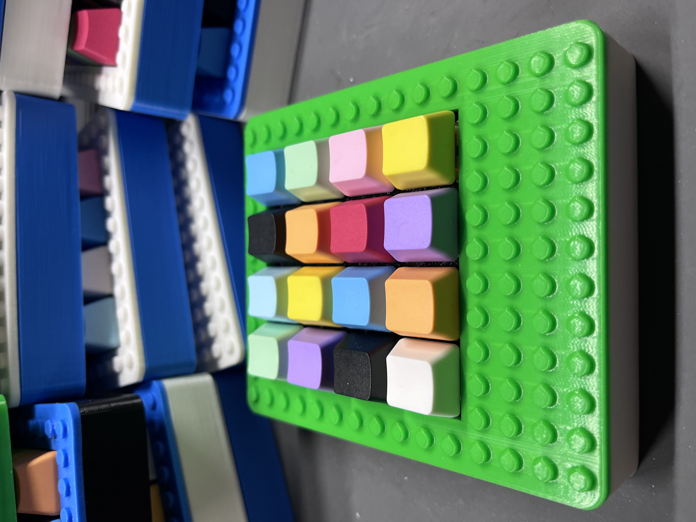

# 4x4 Macropad

The Macropad is a 16-key keyboard with assignable keys via Python and the KMK library. The microcontroller uses the CircuitPython firmware.

## Usage

Plug the Macropad into your PC with a USB C cable. Windows Explorer may open, since the CircuitPython firmware on the microcontroller may be detected as a mass storage device. You can close Windows Explorer, unless you'd like to customize the keymap.

## Default Keymap

> ℹ️ **Info**
> Row 1, Column 1 is the key closest to the USB C port)

| Row \ Col | Col 1                                | Col 2                           | Col 3                               | Col 4                         |
| --------- | ------------------------------------ | ------------------------------- | ----------------------------------- | ----------------------------- |
| **Row 1** | Ctrl + A (Select All)             | Ctrl + C (Copy)              | Ctrl + V (Paste)                 | Ctrl + S (Save)            |
| **Row 2** | Ctrl + Shift + M (Teams Mute Mic) | Mute Speakers                   | Volume Down                         | Volume Up                     |
| **Row 3** | Win + M (Open Mail)               | Win + E (Open File Explorer) | Terminal Macro                      | Calculator Macro              |
| **Row 4** | Ctrl + Z (Undo)                   | Ctrl + Y (Redo)              | Win + Shift + S  (Snipping Tool) | Win + Tab (Switch Windows) |

## Customizing the Keymap

To customize the keymap:

1. Plug in the Macropad via USB C cable
2. Open the CIRCUITPY drive inside of Windows Explorer
3. Open code.py inside of any IDE or Notepad.
4. Scroll down to this section where `keyboard.keymap` is defined
5. Change the key values assigned to each key, as needed
6. Save the updated code.py file
7. You might need to unplug, and replug the Macropad back into the PC for the changes to be detected

[See more documentation on KMK for more customization](https://github.com/KMKfw/kmk_firmware/blob/main/docs/en/Getting_Started.md)

## Parts List

- The case is 3D printable comprised of 3 pieces, designed in Fusion 360, and printed on a BambuLabs P1S printer. They are printed in various colors of PLA filament. There are no screws, as everything is press-fit. See [./Code/](./Code/) for the STL files
- The PCB was designed in KiCad, and manufactured by PCBWay.com. See [./KiCad/](./KiCad/) for the KiCad files.
- [Linear MX Switches](https://www.amazon.com/dp/B0D7QW8SQ9?ref=ppx_yo2ov_dt_b_fed_asin_title&th=1)
- [Blank, Rainbow Mixed Keycaps](https://www.amazon.com/dp/B0CQ2WGP2N?ref=ppx_yo2ov_dt_b_fed_asin_title&th=1)
- [1N4148 Diodes](https://www.amazon.com/dp/B00N1ZKU7E?ref=ppx_yo2ov_dt_b_fed_asin_title)
- [Seeed nRF52840 Sense microcontrollers](https://www.amazon.com/dp/B0DJ6PZGB7?ref=ppx_yo2ov_dt_b_fed_asin_title&th=1)
